<div align="center">
  
  <!-- Banner  -->
  
  
  <br><br>
  
  <!-- Title -->
  <h1>
    
    <span style="background: linear-gradient(135deg, #ff6b9d, #8b5cf6); -webkit-background-clip: text; -webkit-text-fill-color: transparent;">
      GitHub Languages Card
    </span>
  </h1>
  
  <!-- Badges -->
  <p>
    
    
    
    
    
    
  </p>
  
  <!-- Developer Program Badge -->
  <p>
    
  </p>
  
  <!-- Quote -->
  <p>
    <i>✨ Generate beautiful, real-time SVG cards showcasing your GitHub top programming languages ✨</i>
  </p>
  
  <!-- Buttons -->
  <p>
    <a href="https://github-languages-card.vercel.app"></a>
    <a href="https://github-languages-card.vercel.app/api/docs"></a>
    <a href="https://github.com/VIDAKHOSHPEY22/github-languages-card/issues"></a>
  </p>
  
</div>

---

## ✨ Demo

<div align="center">
  
  <a href="https://github-languages-card.vercel.app/">
    
  </a>
  
  <br><br>
  
  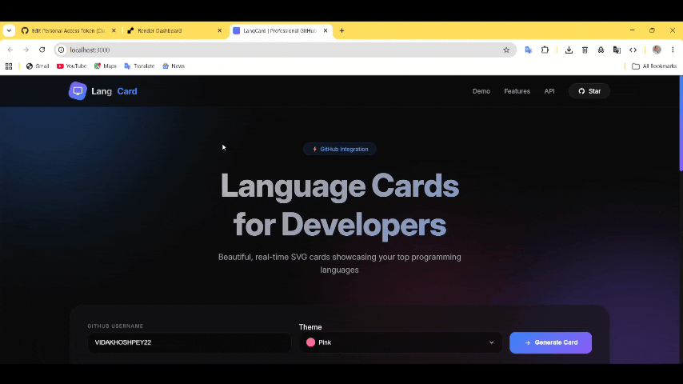
  <br>
  <em>Interactive demo — real-time theme switching & card generation</em>
  
  <br><br>
  
  🔗 **Live URL:** [github-languages-card.vercel.app](https://github-languages-card.vercel.app/)
  
  <br><br>
  
  > **Note for users from restricted regions (e.g., Iran):**  
  > If Vercel is inaccessible, please use a VPN to access the live demo. 🙏
  
</div>

## 🚀 Quick Start

Copy and paste this into your GitHub README.md:

```markdown

```

### Example Result

<div align="center">

  <!-- My Custom Languages Card -->
  <a href="https://github.com/VIDAKHOSHPEY22/github-languages-card">
    
  </a>

  <br><br>

  <!-- Promotion -->
  <div style="background: linear-gradient(135deg, #ff6b9d, #8b5cf6); padding: 10px 20px; border-radius: 40px; display: inline-block;">
    <strong style="color: white;">✨ Built by VIDAKHOSHPEY22 with LangCard ✨</strong>
  </div>

  <br><br>

  <!-- Get Your Own -->
  <div>
    <a href="https://github.com/VIDAKHOSHPEY22/github-languages-card">
      
    </a>
    <a href="https://github-languages-card.vercel.app">
      
    </a>
  </div>

  <br>

  <!-- Code -->
  <div style="background: #0a0a0a; padding: 12px; border-radius: 12px; max-width: 500px;">
    <code></code>
  </div>

  <br>

  <sub>🎨 18+ themes | ⚡ Real-time | 🚀 Open Source</sub>

</div>

## 🎨 Themes Gallery

Choose from **18+ professionally designed themes** to match your style. Here are our **most beautiful themes**:

<div align="center">
  
| Theme | Preview | Theme | Preview |
|-------|---------|-------|---------|
| **Pink** ⭐ | 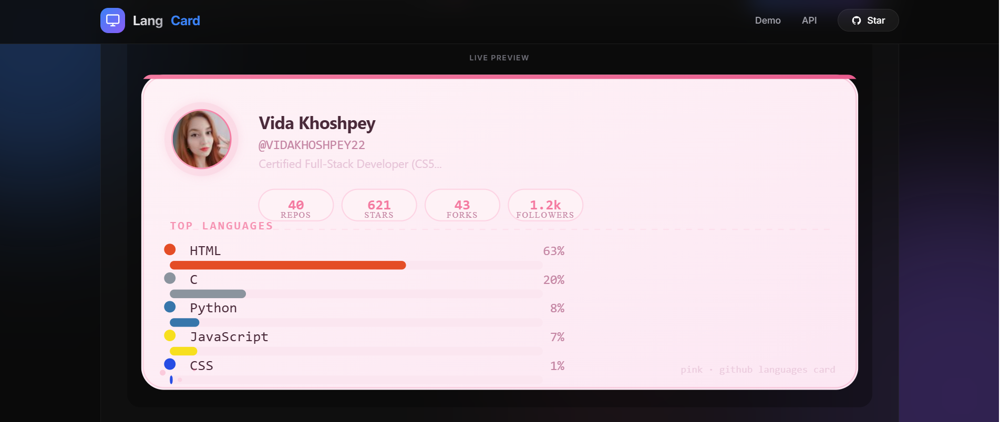 | **Dark Neon** 💚 | 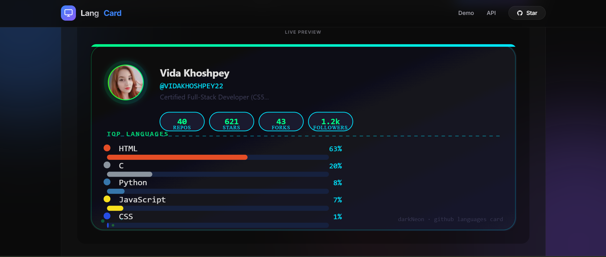 |
| **Neon** 💙 | 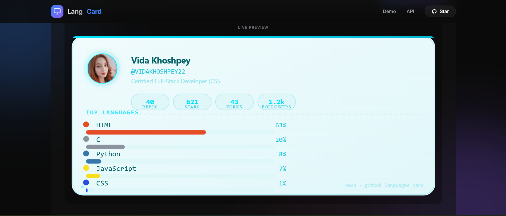 | **Hacker** 💚 | 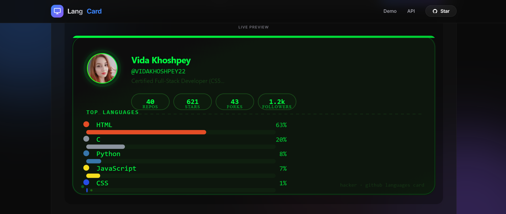 |
| **Purple** 💜 | 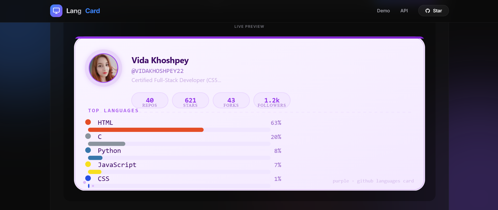 | **Coffee** 🤎 | 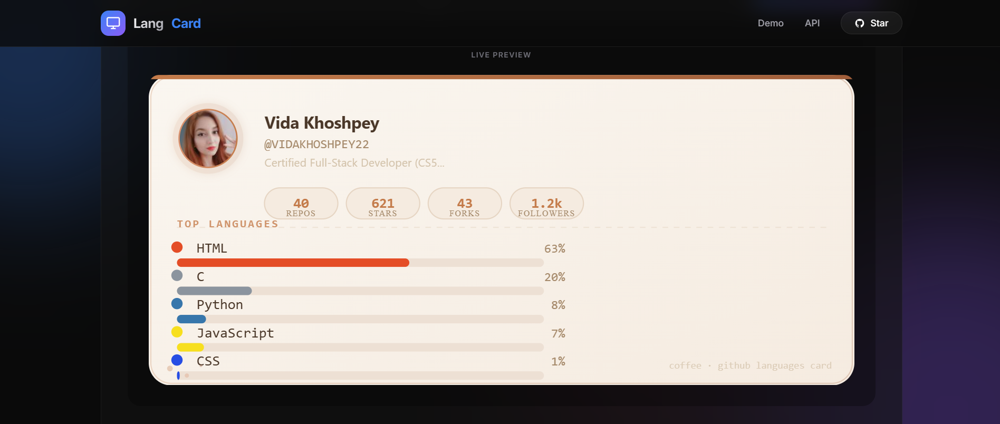 |
| **Golden** ⭐ | 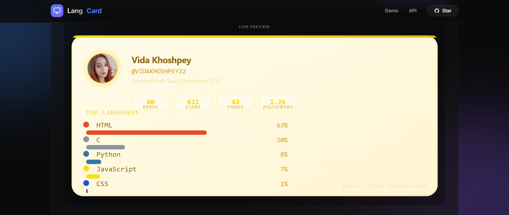 | **Ocean** 🌊 | 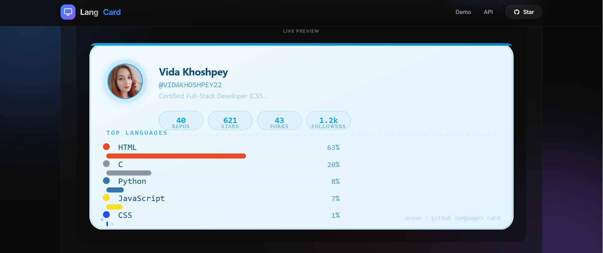 |
| **Sunset** 🌅 | 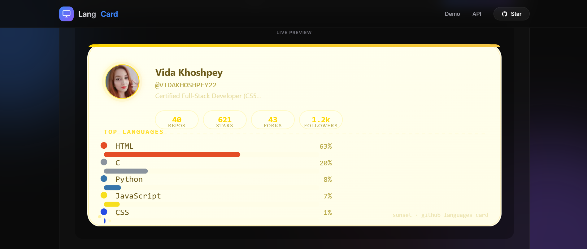 | **Fire** 🔥 | 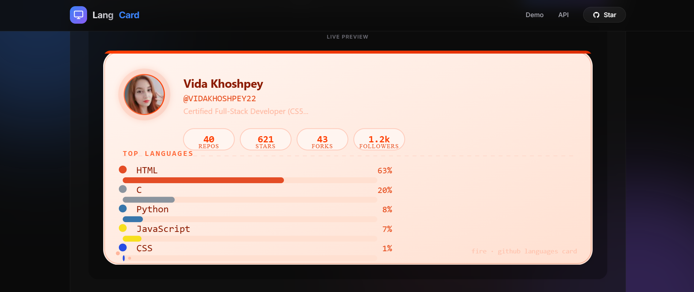 |
| **Mint** 🌿 | 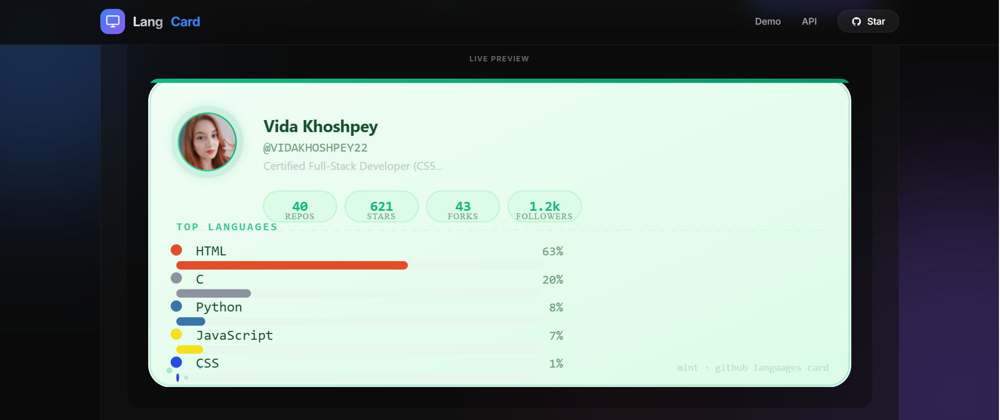 | **Strawberry** 🍓 | 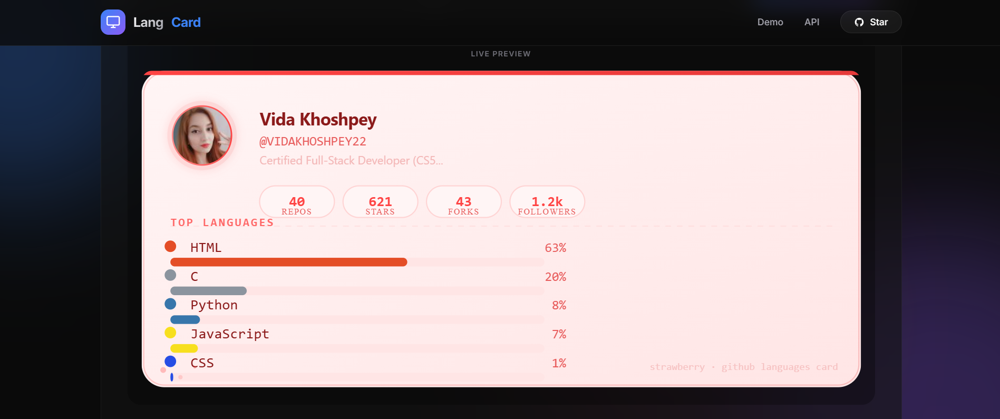 |
| **Lavender** 🌸 | 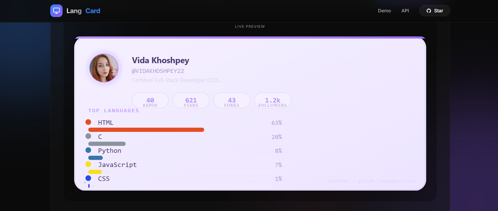 | **Peach** 🍑 | 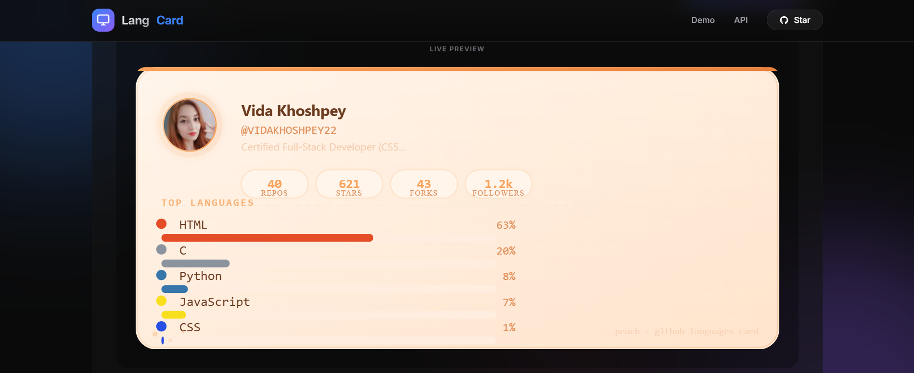 |
| **Dark** 🌙 | 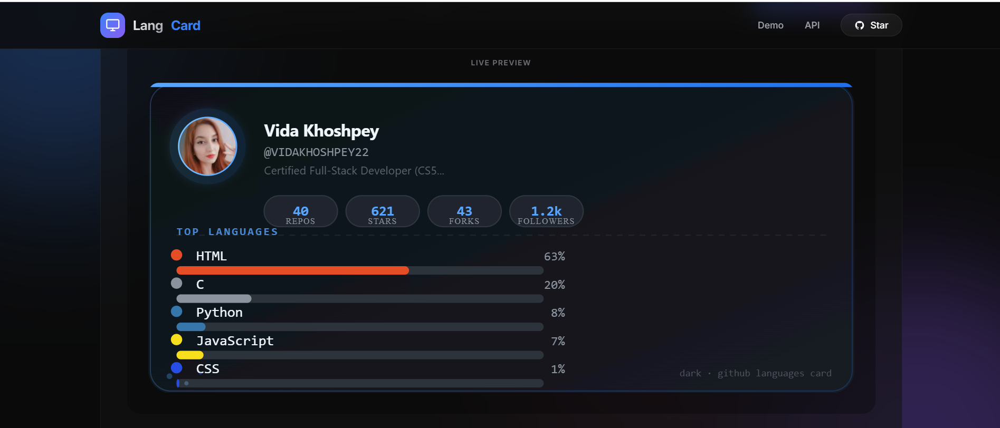 | **Graphite** ⚫ | 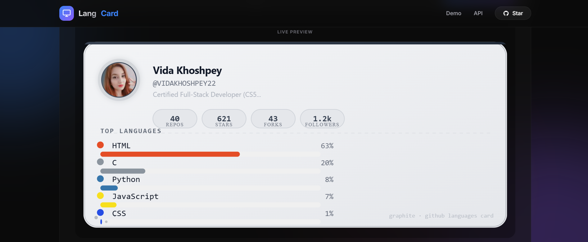 |
| **Snow** ❄️ | 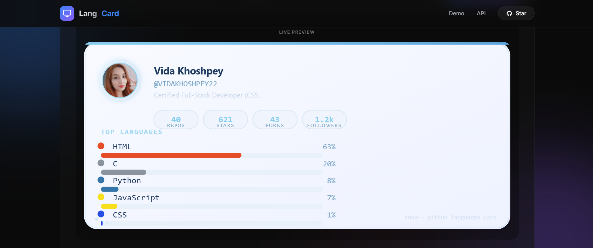 | **White** 🤍 | 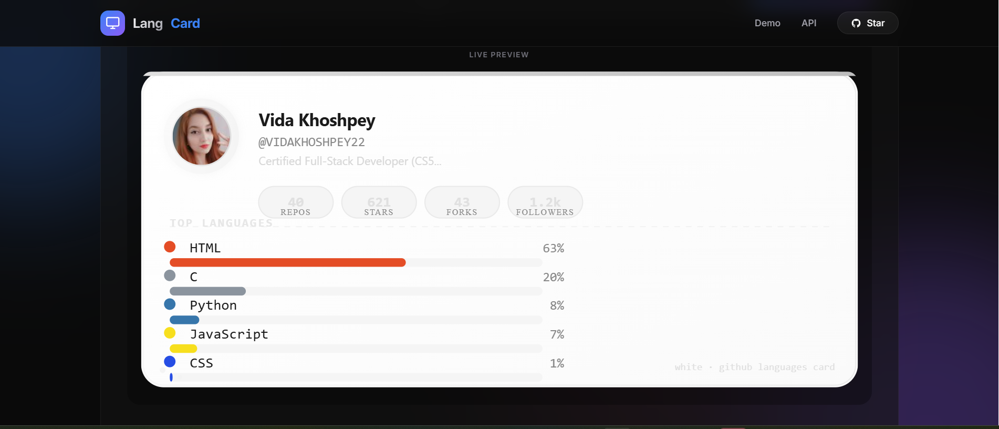 |

</div>

### 🌟 Top Picks (Most Popular)

<div align="center">
  
| Rank | Theme | Why It's Special |
|------|-------|------------------|
| 1 🥇 | **Pink** | Sweet, modern, and eye-catching gradient |
| 2 🥈 | **Dark Neon** | Cyberpunk vibes with glowing effects |
| 3 🥉 | **Neon** | Bright, energetic, and futuristic |
| 4 | **Hacker** | Classic matrix-style green on black |
| 5 | **Coffee** | Warm, cozy, and professional |
| 6 | **Purple** | Royal and elegant deep purple tones |
| 7 | **Golden** | Premium, luxurious golden gradient |
| 8 | **Ocean** | Calm, professional blue tones |

</div>


## 📊 Features

<div align="center">
  
| Feature | Description |
|---------|-------------|
| 🎨 **18+ Themes** | Professionally designed color schemes |
| 📈 **Top Languages** | Shows your most used programming languages with percentages |
| 👥 **GitHub Stats** | Displays repositories, followers, stars, and forks |
| 🖼️ **Avatar Support** | Shows your GitHub profile picture |
| 📱 **Responsive** | Works perfectly on all devices |
| ⚡ **Real-time** | Live preview with instant theme switching |
| 🔒 **Privacy Focused** | No data storage, direct API calls |
| 🚀 **Fast Loading** | Optimized SVG generation with caching |

</div>

## 🛠️ API Documentation

### Endpoint

```
GET /api/top-languages
```

### Parameters

| Parameter | Type | Required | Default | Description |
|-----------|------|----------|---------|-------------|
| `username` | string | ✅ Yes | - | GitHub username |
| `theme` | string | ❌ No | `pink` | Theme name (see themes list below) |

### Example Request

```bash
curl "https://github-languages-card.vercel.app/api/top-languages?username=VIDAKHOSHPEY22&theme=hacker"
```

### Available Themes

```
pink, dark, mint, purple, ocean, sunset, graphite, coffee, 
lavender, peach, neon, strawberry, darkNeon, fire, snow, 
hacker, white, golden
```

### Response Format

The API returns an SVG image that can be embedded directly in markdown:

```markdown

```

## 💻 Self-Hosting

### Prerequisites

- Node.js (v18 or higher)
- npm or yarn
- Git

### Installation

1. **Clone the repository**
```bash
git clone https://github.com/VIDAKHOSHPEY22/github-languages-card.git
cd github-languages-card
```

2. **Install dependencies**
```bash
npm install
```

3. **Configure environment**
```bash
cp .env.example .env
# Edit .env with your GitHub token (optional but recommended)
```

4. **Start the server**
```bash
node server.js
```

5. **Open your browser**
```
http://localhost:3000
```

### Docker Deployment

Create a `Dockerfile`:

```dockerfile
FROM node:18-alpine
WORKDIR /app
COPY package*.json ./
RUN npm ci --only=production
COPY . .
EXPOSE 3000
CMD ["node", "server.js"]
```

Build and run:

```bash
docker build -t langcard .
docker run -p 3000:3000 langcard
```

### Environment Variables

| Variable | Description | Default |
|----------|-------------|---------|
| `PORT` | Server port | `3000` |
| `GITHUB_TOKEN` | GitHub API token (higher rate limit) | - |
| `NODE_ENV` | Environment | `development` |
| `RENDER_EXTERNAL_URL` | External URL for production | - |

## 🎯 Use Cases

- **GitHub Profile README** - Showcase your coding skills
- **Developer Portfolio** - Display your tech stack
- **Team Dashboard** - Monitor team language usage
- **Coding Blog** - Add interactive stats to articles
- **CV/Resume** - Showcase your programming language proficiency

## 📁 Project Structure

```
github-languages-card/
├── server.js              # Main Express server
├── public/                # Static files
│   ├── index.html         # Landing page
│   └── images/            # Documentation images
├── utils/                 # Utility functions
│   ├── github.js          # GitHub API integration
│   ├── svgBuilder.js      # SVG card builder
│   └── helpers.js         # Helper functions
├── themes/                # Theme definitions
│   ├── pink.js
│   ├── dark.js
│   ├── mint.js
│   └── ... (all themes)
├── .env                   # Environment variables
├── package.json           # Dependencies
└── README.md              # Documentation
```

## 🔧 Tech Stack

<div align="center">
  
| Technology | Purpose |
|------------|---------|
|  | Runtime Environment |
|  | Web Framework |
|  | HTTP Client |
|  | Graphics Generation |

</div>

## 📸 Screenshots

<div align="center">
  
  <br>
  <em>Main application interface with live preview</em>
</div>

## 🤝 Contributing

Contributions are what make the open source community such an amazing place! Any contributions you make are **greatly appreciated**.

1. Fork the Project
2. Create your Feature Branch (`git checkout -b feature/AmazingFeature`)
3. Commit your Changes (`git commit -m 'Add some AmazingFeature'`)
4. Push to the Branch (`git push origin feature/AmazingFeature`)
5. Open a Pull Request

### Development Setup

```bash
# Install dependencies
npm install

# Run in development mode
node server.js

# The server will restart on changes
```

## 🐛 Known Issues

- GitHub API has rate limits (60 requests/hour without token)
- Use `GITHUB_TOKEN` environment variable for higher limits (5000/hour)
- First request may be slow due to GitHub API response time

## 👨‍💻 Author

<div align="center">
  
  | Vida Khoshpey | Yalda Khoshpey |
  |:---:|:---:|
  | <a href="https://github.com/VIDAKHOSHPEY22"></a> | <a href="https://github.com/YALDAKHOSHPEY"></a> |
  | 📧 vviiddaa2@gmail.com | 📧 yaldatwin@gmail.com |
  
  <br>
  
  ### 📬 Contact Us
  
  [](mailto:vviiddaa2@gmail.com)
  [](mailto:yaldatwin@gmail.com)
  
  <br>
  
  <sub>Made with ❤️ by <strong>Vida & Yalda</strong> — Twin Coders 👯‍♀️</sub>
  
</div>

---

# ⭐ Support This Project

<br>

<a href="https://github.com/VIDAKHOSHPEY22/github-languages-card">
  
</a>

<br><br>

## 📊 GitHub Stats

<br>

<p>
  
  
</p>

<br>


<br><br>

---

## 📜 License

**MIT License • Open Source**

<br>

<a href="#-github-languages-card">
  
</a>

</div>
